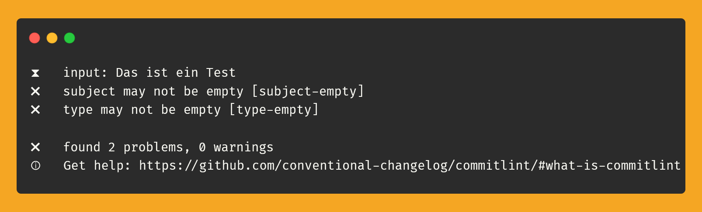
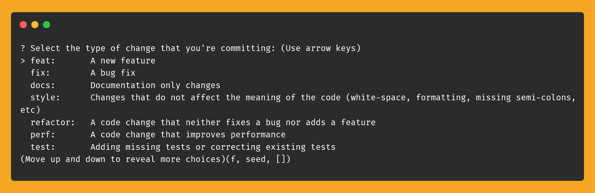
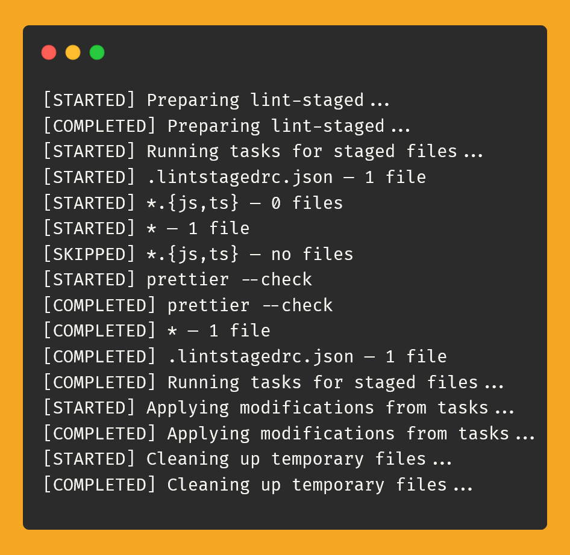

[![Last commit][commit-shield]][commit-url]

[![Open issues][issues-shield]][issues-url]
[![Open pull requests][pr-shield]][pr-url]

[![License][license-shield]][license-url]

<br />
<p align="center">
  <h3 align="center">clean-commits-example</h3>

  <p align="center">
    This is a example repository on how to do clean commits and force conventions like <a href="https://www.conventionalcommits.org/en/v1.0.0/">Conventional Commits</a> or <a href="https://gitmoji.dev/specification">Gitmoji</a>
    <br />
    <br />
    <a href="https://github.com/devtobi/clean-commits-example/issues/new/choose">Report Bug</a>
    ·
    <a href="https://github.com/devtobi/clean-commits-example/issues/new/choose">Request Feature</a>
  </p>
</p>

<!-- TABLE OF CONTENTS -->

## Table of Contents

- [About the Project](#about-the-project)
  - [Built With](#built-with)
- [Getting Started](#getting-started)
  - [Prerequisites](#prerequisites)
  - [Installation](#installation)
- [Usage](#usage)
- [Authors](#authors)
- [License](#license)

## About The Project

This little example repository utilizes different tools to force developers to use a convention for commit messages. This is especially useful when working with tools for automated releases and versioning like [semantic-release](https://github.com/semantic-release/semantic-release) or [release-it](https://github.com/release-it/release-it). It forces the developer to better think about the purpose and effects of the commits.

As a bonus, this repository also shows how to enforce running of formatters of linters (or even unit tests) before commitin by using Git Hooks. This can be another 'security' mechanism for good code on top of the mechanisms inside CI/CD pipelines and will lead to fewer unnecessary pipeline runs (and save money).

### Built With

- [husky](https://github.com/typicode/husky) (to easily work with git hooks)
- [commitlint](https://github.com/conventional-changelog/commitlint) (to check commit messages for compliance to chosen convention)
- [commitizen](https://github.com/commitizen/cz-cli) (to help write commit messages as defined in the chosen convention)
- [lint-staged](https://github.com/lint-staged/lint-staged) (to automatically lint staged files when commiting)
- [prettier](https://github.com/prettier/prettier) (as an example formatter, could be anything)
- [eslint](https://github.com/eslint/eslint) (as an example linter, could be anything)

Furthermore:

- [@commitlint/config-conventional](@commitlint/config-conventional) (as a example convention to use for commit messages, in my opinion also the best)
- [@commitlint/cz-commitlint](https://www.npmjs.com/package/@commitlint/cz-commitlint) (to integrate commitlint configuration with commitizen)

Documentation for the tools mentioned:

- [husky documentation](https://typicode.github.io/husky/how-to.html)
- [commitlint documentation](https://commitlint.js.org/reference/configuration.html)
- [commitizen documentation](http://commitizen.github.io/cz-cli/)
- [lint-staged documentation](https://github.com/lint-staged/lint-staged?tab=readme-ov-file#configuration)

## Getting Started

To try out the mechanisms for yourself, you can use this repository as a 'playground' locally on your computer.

To get a local copy up and running follow these simple steps.

### Prerequisites

I assume you have a current version of [git](https://git-scm.com) running on your system.

Because the tools heavily rely on Node you need to have a up-to-date (LTS) version of [Node](https://nodejs.org/en) installed on your system.

The project manages its dependencies via [bun](https://bun.sh) (in my opinion the better npm, never went back). You need to have `bun` installed on your system if you want this repository to work out-of-the-box.

**Tip**: If you (for some reason) don't want or can't use `bun`, see step 2 in installation below.

### Installation

1. Clone the repo:

   ```sh
   git clone https://github.com/devtobi/clean-commits-example.git
   ```

2. (**Optional**): Switch to `npm` (if you don't have `bun`):

   - Replace hook call inside `.husky` directory to use `npm` instead of `bun`
   - Remove `bun.lockb` from the file system

3. Install dependencies and initialize the git hooks via `husky`:

   - bun: `bun install` or
   - npm: `npm install`

4. You are ready to go and checkout the features setup in this repository! Congratulations!

## husky

The tool `husky` integrates the above-mentioned tools `commitlint`, `commitizen` and `lint-staged` into the normal workflow with `git` via Git Hooks. Tools can therefore be integrated via regular commands such as `git commit`.

**Tip**: Git Hooks can be created file-based via the `.husky` folder and Git Hooks can be shared with all project members. These must therefore always be checked in to VCS.

An `npm install` (see step 2 above) also installs the hooks. Alternatively, the script `npm run prepare` can be called explicitly.

**Attention**: After changing a hook, all developers must run `npm run prepare` again to activate the changes on their own machine.

## Usage

### 1. Perform valid commit

First try to change the example file `dummy.txt` and create a commit using `git commit -m "mymessage"`. This project uses the [Conventional Commits](https://www.conventionalcommits.org/en/v1.0.0/#specification) convention, so the commit message must correspond to the format `type(scope): description`.

Example: `git commit -m "refactor(api): refactored dummy api endpoint"`

The commit should be successful.

### 2. Perform invalid commit

Change the `dummy.txt` again and try a second commit. This time, however, explicitly violate the configured convention.

Example: `git commit -m "This is a test"`

The commit should fail and `commitlint` should display a message about the errors and warnings found in the message. It looks like this, for example:



The convention used by `commitlint` is defined in [`commitlint.config.mjs`](commitlint.config.mjs). You can experiment with other conventions by installing [additional npm packages](https://www.npmjs.com/search?q=commitlint%2Fconfig) or extend the configuration file to meet your own specific needs by [creating your own rules](https://commitlint.js.org/reference/rules-configuration.html).

A minimal configuration for `commitlint` looks like this (and follows the convention "Conventional Commits"):

```js
export default {
  extends: ["@commitlint/config-conventional"],
};
```

### 3. Commit interactively

If you need help writing your commit message, simply run `git commit` and the interactive CLI `commitizen` will appear to assist you according to the configured convention.

The interactive interface will look like this:



The interactive CLI can be configured via the file [`.czrc`](/.czrc). There are various [adapter packages](https://github.com/commitizen/cz-cli?tab=readme-ov-file#adapters) to support different conventions.

**Tip:** We recommend using the adapter [`@commitlint/cz-commitlint`](https://www.npmjs.com/package/@commitlint/cz-commitlint), as this integrates the two tools `commitlint` and `commitizen` and the `commitlint` configuration is also automatically used for the interactive CLI.

A minimal configuration for `commitizen` (with inheritance of the `commitlint` convention) looks as follows:

```json
{
  "path": "@commitlint/cz-commitlint"
}
```

### 4. Linting and formatting before committing

Put an invalid change to the file `dummy.js` in the git staging area (via IDE or via `git add dummy.js`) and try to commit it. `lint-staged` scans files in the staging area and has them checked by the configured tools. An error should then have occurred due to `prettier` or `eslint`, depending on whether it is a formatting problem or a coding problem. The commit was not carried out.

An example error message looks like this:



The linter and formatter to be used by `lint-staged` can be configured in the file [`.lintstagedrc.json`](/.lintstagedrc.json). CLI tools to be executed are specified here using pattern matching on file extensions. If several patterns are matched, several tools are also executed in parallel.

An example configuration for `lint-staged` looks as follows:

```json
{
  "*.{js,ts}": ["eslint"],
  "*": "prettier --check"
}
```

With the above configuration, for example, a `dummy.js` file is checked in parallel using `eslint` and `prettier --check`. A file `dummy.json` would only be checked by `prettier --check`. More information on the configuration can be found [in the official documentation](https://github.com/lint-staged/lint-staged?tab=readme-ov-file#configuration).

### End

Congratulations! You have tried out all the use cases!

Further examples can be found in the documentation of the tools used:

- [husky documentation](https://typicode.github.io/husky/how-to.html)
- [commitlint documentation](https://commitlint.js.org/reference/configuration.html)
- [commitizen documentation](http://commitizen.github.io/cz-cli/)
- [lint-staged-documentation](https://github.com/lint-staged/lint-staged?tab=readme-ov-file#configuration)

## Authors

- **Tobias Stadler** - [devtobi](https://github.com/devtobi)

<!-- LICENSE -->

## License

Distributed under the MIT License. See [LICENSE][license-url] for more information.

<!-- MARKDOWN LINKS & IMAGES -->
<!-- https://www.markdownguide.org/basic-syntax/#reference-style-links -->

[issues-shield]: https://img.shields.io/github/issues-raw/devtobi/clean-commits-example?style=for-the-badge&logo=github
[issues-url]: https://github.com/devtobi/clean-commits-example/issues?q=is%3Aopen+is%3Aissue+
[pr-shield]: https://img.shields.io/github/issues-pr-raw/devtobi/clean-commits-example?style=for-the-badge&logo=github&label=Pull%20Requests
[pr-url]: https://github.com/devtobi/clean-commits-example/pulls?q=is%3Apr+is%3Aopen
[license-shield]: https://img.shields.io/github/license/devtobi/clean-commits-example.svg?style=for-the-badge&logo=github
[license-url]: https://github.com/devtobi/clean-commits-example/blob/main/LICENSE
[commit-shield]: https://img.shields.io/github/last-commit/devtobi/clean-commits-example?style=for-the-badge&logo=github
[commit-url]: https://github.com/devtobi/clean-commits-example/commit/main
